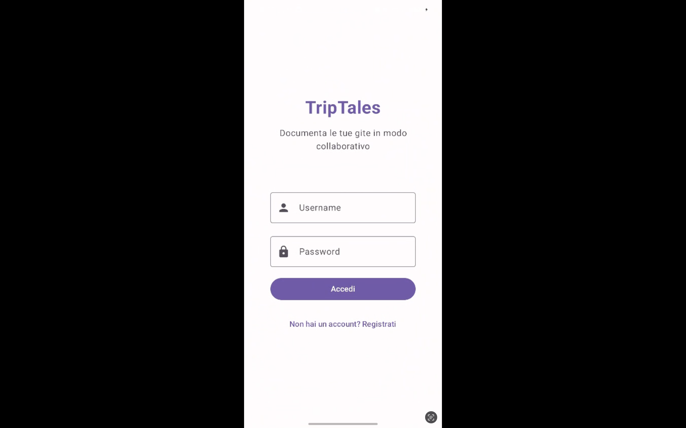
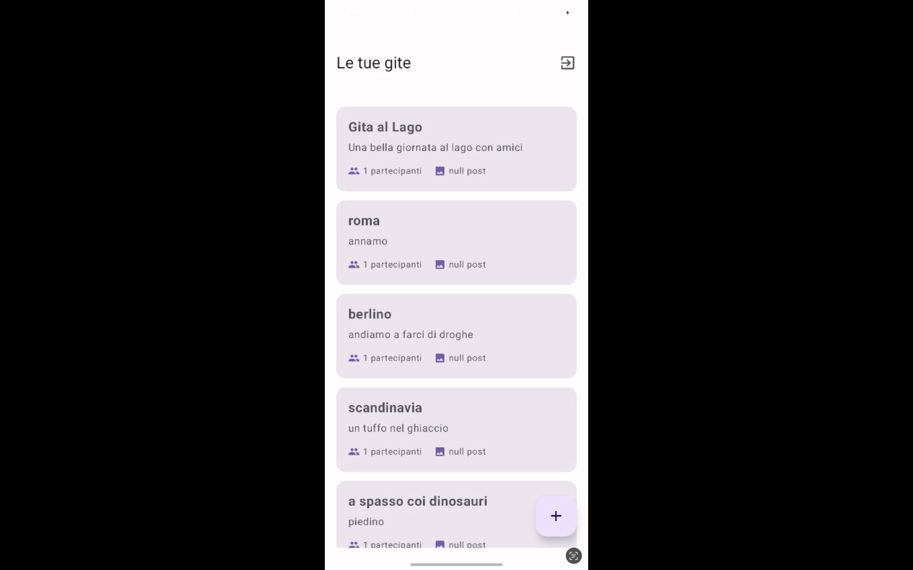

# 📔 TripTales – Frontend Android

**TripTales** è un'app Android sviluppata con **Jetpack Compose** che consente agli studenti di documentare in modo collaborativo e intelligente i momenti salienti di una gita scolastica. L'app sfrutta funzionalità avanzate offerte da **Firebase ML Kit**, **CameraX** e **Google Maps API** per offrire un'esperienza educativa, interattiva e coinvolgente.

---

## 🎯 Obiettivo

Permettere agli utenti di:
- Creare o unirsi a gruppi di gita.
- Caricare foto geolocalizzate, aggiungere descrizioni, didascalie intelligenti, e commenti.
- Utilizzare l'intelligenza artificiale per tradurre, leggere testi nelle immagini, riconoscere oggetti e volti.
- Visualizzare tutto ciò sulla mappa condivisa del gruppo.
- Accumulare badge e like in un sistema di gamification.

---

## 🧩 Funzionalità Implementate (Frontend)

### 👤 Autenticazione & Gruppi
- Registrazione e login tramite API backend.
- Creazione e unione a gruppi di gita.

### 📸 Fotocamera & ML Kit
- Scatto foto tramite **CameraX** integrato.
- OCR per lettura testi (es. cartelli turistici).
- Traduzione automatica dei testi OCR (es. per gite all’estero).
- Riconoscimento di oggetti (es. monumenti, edifici).
- Face Detection per sticker o effetti.
- Generazione automatica di una didascalia (caption intelligente).

### 🗺️ Geolocalizzazione & Mappe
- Utilizzo di **Google Maps API**.
- Visualizzazione dei luoghi e foto geotaggate sulla mappa del gruppo.

### 💬 Diario & Interazione
- Bacheca condivisa con diario di gita.
- Commenti sulle foto.
- Like ai post degli altri utenti.

### 🏅 Badge & Classifica
- Badge assegnati in base all’attività svolta (Esploratore, Traduttore, ecc.).
- Classifica interna in base ai like ricevuti.

---

## 🛠️ Stack Tecnologico

- **Linguaggio**: Kotlin
- **UI Toolkit**: Jetpack Compose
- **Fotocamera**: CameraX
- **AI & ML**: Firebase ML Kit
- **Mappa**: Google Maps SDK
- **Networking**: Retrofit2 + Moshi
- **State Management**: ViewModel + LiveData / State
- **Navigation**: Jetpack Navigation Compose
- **Repository GitHub**: `pw-frontend-triptales`

---

## 📷 Screenshot dell'app

| Login & Registrazione | Home | New Event |
|--------------------|------------------|--------------------|
|  |  |  |

---

## 🧪 Come installare ed eseguire l'app

### ✅ Prerequisiti
- Android Studio Electric Eel o superiore
- Emulator o dispositivo fisico con Android 10+
- Google Maps API key
- Firebase configurato con ML Kit abilitato

### ⚙️ Clonazione del progetto

```bash
git clone https://github.com/<tuo-utente>/pw-frontend-triptales.git
cd pw-frontend-triptales
